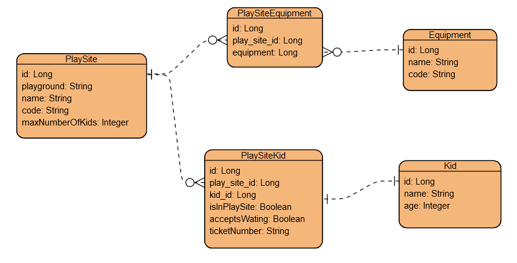

# Playgroung API

### How to run the application
Build jar file by executing this command:  
`mvn install`  
Run the application:  
`mvn compile exec:java`  

### Test the application    
POST http://localhost:8083/playground/api/playsites  
{
    "name" : "Play Site 1",
    "code" : "PlaySite1",
    "maxNumberOfKids" : "2"
}

GET http://localhost:8083/playground/api/equipments  

PATCH http://localhost:8083/playground/api/playsites/1/equipments  
{
    "id" : 1
}

PATCH http://localhost:8083/playground/api/playsites/1/kids  
{
  "name": "Petras",
  "age": 15,
  "acceptsWaiting": true,
  "ticketNumber": "56551"
}

GET http://localhost:8083/playground/api/playsites  

GET http://localhost:8083/playground/api/kids  

DELETE http://localhost:8083/playground/api/playsites/1/kids/1  

GET http://localhost:8083/playground/api/playgrounds  

### Open API and database details
Open API documentation could be access by this link:  
<a href="http://localhost:8083/swagger-ui.html" target="_blank">http://localhost:8083/swagger-ui.html</a>  

Open API definition:  
<a href="http://localhost:8083/api-docs" target="_blank">http://localhost:8083/api-docs</a>

Database could be accessed by this link:      
<a href="http://localhost:8083/h2-console/" target="_blank">http://localhost:8083/h2-console/</a>   
Database connection details:  
JDBC Url: jdbc:h2:mem:playground  
user: sa  
password: sa  
Database ER diagram:  
